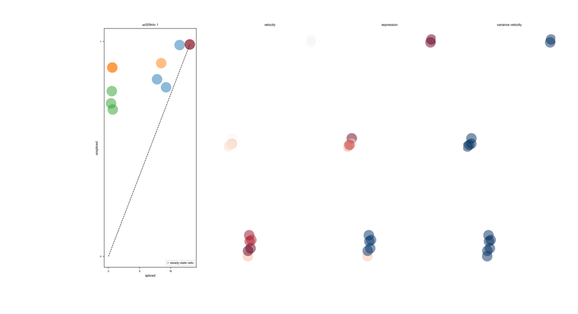

# Inferring RNA-Velocity in Bulk RNA-Seq samples

## What is RNA-Velocity?
RNA-Velocity in simple words the ratio of spliced vs unspliced transcripts. mRNA splicing kinetics: 
Transcriptional induction for a particular gene results in an increase of (newly transcribed) precursor unspliced mRNAs 
while, conversely, repression or absence of transcription results in a decrease of unspliced mRNAs. 
Please see: https://www.nature.com/articles/s41586-018-0414-6)

 Source: https://scvelo.readthedocs.io/

Please suggest improvements by forking a branch and report bugs on Issues section.

## Software/Tool Requirements:
STAR [version 2.6.1 =>]  [https://github.com/alexdobin/STAR]
python3 [version 3.7.1]  [https://www.python.org/downloads/]
R [version 3.5.0 =>]     [https://www.r-project.org/]
simplesam - a python module [https://simplesam.readthedocs.io/en/latest/#]
samtools [version 1.8.0 =>] [http://www.htslib.org/]
velocyto [http://velocyto.org/velocyto.py/install/index.html]
scVelo [https://scvelo.readthedocs.io/]
loompy - a python module [http://linnarssonlab.org/loompy/installation/index.html]
scanpy [https://scanpy.readthedocs.io/en/stable/installation.html]
pandas - a python module [https://pandas.pydata.org/]
numpy - a python module [https://numpy.org/]
matplotlib - a python module [https://matplotlib.org/]


### Major Steps for inferring RNA-Velocity in Bulk RNA-Seq samples:

1. Map the raw RNA-Seq reads to genome of interest using STAR
2. Sort and Index the Bam file resulting from Step1 using samtools
3. Run simplesam module in python to add UMI and Barcode tags
4. Remove reads mapped to chr's (tagged as random) or short scaffolds using samtools
5. Run Velocyto on the bam resulting from Step4 with -U option
6. Run scVelo on the loom file resulting from Step5

### Steps in Detail:

#### Step 1: 

```
STAR --genomeDir STAR-Genome-Index --readFilesIn FASTQ-FILES --readFilesCommand gunzip -c
 --outFileNamePrefix OUTbam --runThreadN 4 --outSAMstrandField intronMotif --outSAMtype BAM Unsorted 
 --sjdbGTFfile Genome-GTF
```

#### Step 2:

```
samtools sort OUTbamAligned.out.bam -o OUTbamAligned.out.sorted.bam

samtools index OUTbamAligned.out.sorted.bam
```

#### Step 3:

**Please see SimpleSam.py is available in the repository for download**
```
python3 SimpleSam.py OUTbamAligned.out.sorted.bam OUTbamAligned.simplesam.sam

samtools view -b -o OUTbamAligned.simplesam.bam OUTbamAligned.simplesam.sam

samtools sort OUTbamAligned.simplesam.bam -o OUTbamAligned.simplesam.sorted.bam
```

#### Step 4:

```
samtools view -b OUTbamAligned.simplesam.sorted.bam chr1 chr10 chr11 chr12 chr13 chr14 chr15 chr16 chr17 chr18
chr19 chr20 chr21 chr22 chr2 chr3 chr4 chr5 chr6 chr7 chr8 chr9 chrM chrX chrY > OUTbamAligned.velocyto.temp.bam

samtools view -b -F 4 OUTbamAligned.velocyto.temp.bam > OUTbamAligned.velocyto.mapped.bam

samtools sort OUTbamAligned.velocyto.mapped.bam -o OUTbamAligned.velocyto.sorted.bam

samtools index OUTbamAligned.velocyto.sorted.bam
```

#### Step 5:

```
velocyto run -U -m GENOME-MASKED-GTF --outputfolder VELOCYTO_OUT OUTbamAligned.velocyto.sorted.bam Genome-GTF
```

#### Step 6:
__If Multiple samples please combine .loom files using command -- python3 LoomCombine.py__   
__Please see LoomCombine.py is available in the repository for download__
```
python3 scVelo.py VELOCYTO_OUT.loom OUTFILE-PREFIX
```
__scVelo.py has a requirement of Annotations.txt file to back-map sample information in case of multiple 
samples processed using combined loom file__

### Example graphs

